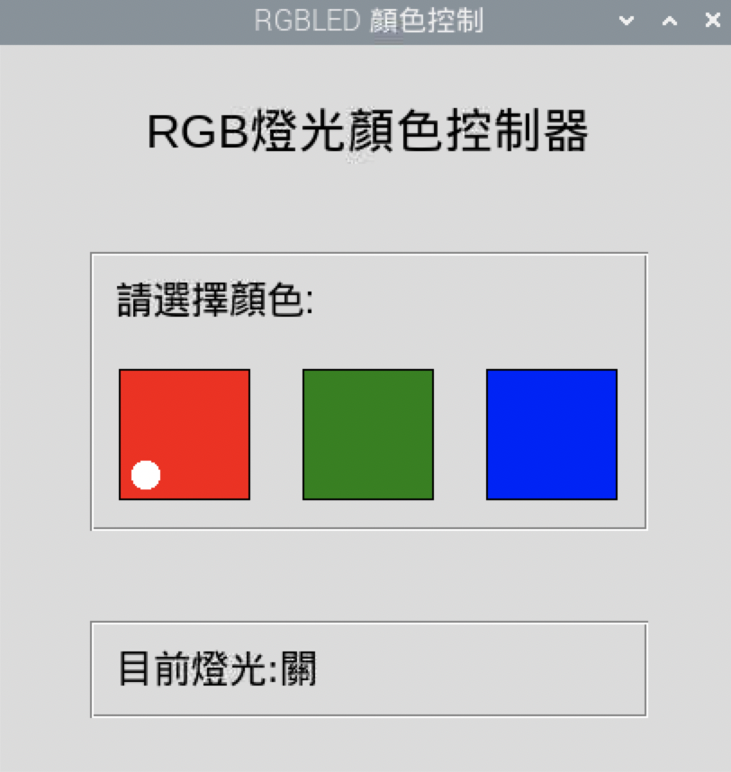

# 4.Button RGBLED

## 線路圖


## signal

```python
#http://stupidpythonideas.blogspot.com/2013/10/why-your-gui-app-freezes.html
from gpiozero import RGBLED,Button
from time import sleep
from signal import pause
from random import randint

def user_press():
    r = randint(0,100) / 100;
    g = randint(0,100) / 100;
    b = randint(0,100) / 100;
    print("R={},G={},B={}".format(r,g,b));
    led.color = (r, g, b);

button = Button(18);
led = RGBLED(red=17, green=27, blue=22);

button.when_pressed = user_press;
pause();

```

## tkinter, 繼承Canvas(畫圖) , 建立@property, gpiozero

```python
import tkinter as tk

class ColorCanvas(tk.Canvas):
    #建立Class的propertuy
    #建立一個Class內建的常數
    ON =  True
    OFF = False
    def __init__(self,parent,rec_color,**kwargs):
        self.width = kwargs['width']
        self.height = kwargs['height']
        super().__init__(parent,**kwargs)
        self.rec_color = rec_color
        self.__state = ColorCanvas.OFF
        self.space = self.width / 7
           
        self.create_rectangle(self.space, self.space, self.width - self.space, self.height - self.space,fill=self.rec_color)

    
    @property
    def state(self):
        return self.__state
    @state.setter
    def state(self,s):
        self.__state  = s
        self.delete()
        self.create_rectangle(self.space, self.space, self.width - self.space, self.height - self.space,fill=self.rec_color)        
        if self.__state == True:
            #多加小圓點
            print("多加小圓點")
            rec_width = self.width  - 2 * self.space 
            rec_height = self.height - 2 * self.space            
            cir_width = rec_width / 5
            cir_height = rec_height / 5
            cir_start_x = self.space + cir_width / 2
            cir_end_x = cir_start_x + cir_width
            cir_start_y = self.space + rec_height * 5 / 7
            cir_end_y  =  cir_start_y + cir_height
            self.create_oval(cir_start_x,cir_start_y,cir_end_x,cir_end_y,fill='white',outline='white')

       


class Window(tk.Tk):
    selected_convas = None
    @classmethod
    def get_select_convas(cls):
        return cls.selected_convas

    @classmethod
    def set_select_convas(cls,convas):
        if cls.selected_convas is not None:
            cls.selected_convas.state = ColorCanvas.OFF   
        cls.selected_convas = convas
        cls.selected_convas.state = ColorCanvas.ON


    def __init__(self):
        super().__init__()
        #---- start title_frame -----
        title_frame = tk.Frame(self)
        title_frame.pack(pady=(30,0))
        tk.Label(title_frame,text="RGB燈光顏色控制器",font=('Arial',20)).pack()        
        #----- end title_frame ------

        #---- start color_frame -----
        color_frame = tk.Frame(self,borderwidth=2,relief=tk.GROOVE)
        color_frame.pack(padx=50,pady=50) 
        tk.Label(color_frame,text="請選擇顏色:",font=("Arial",16)).grid(row=0,column=0,columnspan=3,sticky=tk.W,padx=10,pady=10)        
        red = ColorCanvas(color_frame,"red",width=100,height=100)
        red.bind('<ButtonRelease-1>',self.mouse_click)
        red.grid(row=1, column=0)               
        green = ColorCanvas(color_frame,"green",width=100,height=100)
        green.bind('<ButtonRelease-1>',self.mouse_click)        
        green.grid(row=1, column=1)        
        blue = ColorCanvas(color_frame,"blue",width=100,height=100)
        blue.bind('<ButtonRelease-1>',self.mouse_click)        
        blue.grid(row=1, column=2)
        Window.set_select_convas(red)
        select_canvas = Window.get_select_convas()
        #---- end color_frame -----

        #---- start light_state_frame -----
        light_state_frame = tk.Frame(self,borderwidth=2,relief=tk.GROOVE)
        state_label =  tk.Label(light_state_frame,text="目前燈光:關",font=('Arail',16),anchor=tk.W)
        state_label.pack(fill=tk.X,padx=10,pady=10)
        light_state_frame.pack(fill=tk.X,padx=50,pady=(0,30))
        #---- end light_state_frame -----
        

    def mouse_click(self,event):
        Window.set_select_convas(event.widget)

def main():
    window = Window()
    window.title("RGBLED 顏色控制")
    window.mainloop()

if __name__ == "__main__":
    main()
```



## tkinter, 繼承Canvas(畫圖) , 建立@property, gpiozero,增加一個Button

```python
import tkinter as tk
from gpiozero import RGBLED
from gpiozero import Button

class ColorCanvas(tk.Canvas):
    #建立Class的propertuy
    #建立一個Class內建的常數
    ON =  True
    OFF = False
    def __init__(self,parent,rec_color,**kwargs):
        self.width = kwargs['width']
        self.height = kwargs['height']
        super().__init__(parent,**kwargs)
        self.rec_color = rec_color
        self.__state = ColorCanvas.OFF
        self.space = self.width / 7
           
        self.create_rectangle(self.space, self.space, self.width - self.space, self.height - self.space,fill=self.rec_color)

    
    @property
    def state(self):
        return self.__state
    @state.setter
    def state(self,s):
        self.__state  = s
        self.delete()
        self.create_rectangle(self.space, self.space, self.width - self.space, self.height - self.space,fill=self.rec_color)        
        if self.__state == True:
            #多加小圓點
            print("多加小圓點")
            rec_width = self.width  - 2 * self.space 
            rec_height = self.height - 2 * self.space            
            cir_width = rec_width / 5
            cir_height = rec_height / 5
            cir_start_x = self.space + cir_width / 2
            cir_end_x = cir_start_x + cir_width
            cir_start_y = self.space + rec_height * 5 / 7
            cir_end_y  =  cir_start_y + cir_height
            self.create_oval(cir_start_x,cir_start_y,cir_end_x,cir_end_y,fill='white',outline='white')

       


class Window(tk.Tk):
    selected_convas = None    
    @classmethod
    def get_select_convas(cls):
        return cls.selected_convas

    @classmethod
    def set_select_convas(cls,convas):
        if cls.selected_convas is not None:
            cls.selected_convas.state = ColorCanvas.OFF   
        cls.selected_convas = convas
        cls.selected_convas.state = ColorCanvas.ON

    light_state = False
    


    def __init__(self):
        super().__init__()
        #---- start title_frame -----
        title_frame = tk.Frame(self)
        title_frame.pack(pady=(30,0))
        tk.Label(title_frame,text="RGB燈光顏色控制器",font=('Arial',20)).pack()        
       

        #---- start color_frame -----
        color_frame = tk.Frame(self,borderwidth=2,relief=tk.GROOVE)
        color_frame.pack(padx=50,pady=50) 
        tk.Label(color_frame,text="請選擇顏色:",font=("Arial",16)).grid(row=0,column=0,columnspan=3,sticky=tk.W,padx=10,pady=10)        
        red = ColorCanvas(color_frame,"red",width=100,height=100)
        red.bind('<ButtonRelease-1>',self.mouse_click)
        red.grid(row=1, column=0)               
        green = ColorCanvas(color_frame,"green",width=100,height=100)
        green.bind('<ButtonRelease-1>',self.mouse_click)        
        green.grid(row=1, column=1)        
        blue = ColorCanvas(color_frame,"blue",width=100,height=100)
        blue.bind('<ButtonRelease-1>',self.mouse_click)        
        blue.grid(row=1, column=2)
        Window.set_select_convas(red)
        select_canvas = Window.get_select_convas()
        

        #---- start light_state_frame -----
        light_state_frame = tk.Frame(self,borderwidth=2,relief=tk.GROOVE)
        self.state_label =  tk.Label(light_state_frame,text="目前燈光:關",font=('Arail',16),anchor=tk.W)
        self.state_label.pack(fill=tk.X,padx=10,pady=10)
        light_state_frame.pack(fill=tk.X,padx=50,pady=(0,30))
        

        #gpiozero->一定要self
            #button
        self.button = Button(18)
        self.button.when_released = self.button_released
            #led
        self.led = RGBLED(red=17, green=27, blue=22)
        self.led.color=(0,0,0)

    def mouse_click(self,event):
        Window.set_select_convas(event.widget)

    def button_released(self):
        Window.light_state = not Window.light_state
        if Window.light_state == True:
            print("開燈")
            self.state_label.config(text="目前燈光:開")
            canvas = Window.get_select_convas()
            if canvas.rec_color == "red":
                self.led.color=(1,0,0)
            elif canvas.rec_color == "green":
                self.led.color=(0,1,0)
            elif canvas.rec_color == "blue":
                self.led.color=(0,0,1)
        else:
            print("關燈")
            self.state_label.config(text="目前燈光:關")
            self.led.color=(0,0,0)

def main():
    window = Window()
    window.title("RGBLED 顏色控制")
    window.mainloop()

if __name__ == "__main__":
    main()
```

