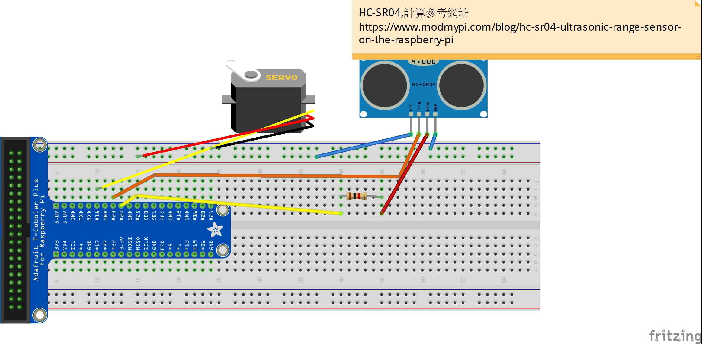
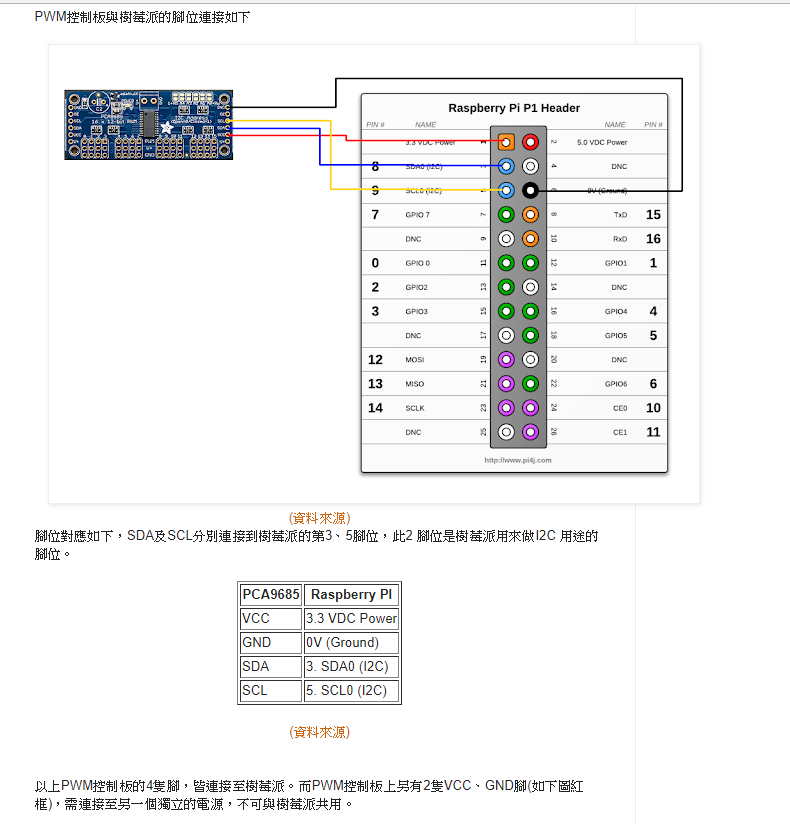

# 6.伺服馬達


## 線路圖



### HR04當作module

```python
import RPi.GPIO as GPIO
import time

class HR04(object):
    def __init__(self,trig,echo):
        GPIO.setmode(GPIO.BCM);
        GPIO.setwarnings(False);
        self.trig = trig;
        self.echo = echo;
        GPIO.setup(self.trig,GPIO.OUT);
        GPIO.setup(self.echo,GPIO.IN);
        print("run");

    def __str__():
        return "control HR04";

    def getCmDistance(self):
        try:
            GPIO.setmode(GPIO.BCM);
            GPIO.setup(self.trig,GPIO.OUT);
            GPIO.setup(self.echo,GPIO.IN);
            
            GPIO.output(self.trig,False);
            time.sleep(0.01);
            GPIO.output(self.trig,True);
            time.sleep(0.00001);
            GPIO.output(self.trig,False);

            while GPIO.input(self.echo) == 0:
                self.pulse_start = time.time();
            
            while GPIO.input(self.echo) == 1:
                self.pulse_end = time.time();

            pulse_duration = self.pulse_end - self.pulse_start;
            distance = pulse_duration * 17150;
            distance = round(distance);
            
            if distance < 2 or distance > 400:
                return None;
            else:
                return distance;
        except:
            
            return None;
```

### servo 和 HR04
```python
from tkinter import *;
from HR04 import HR04;
import threading
from gpiozero import AngularServo;

class App:
    def __init__(self,master):
        self.hr04 = HR04(23,24);        
        self.servo = AngularServo(18,min_angle=0,max_angle=90);
        self.servo.angle=0;
        self.getDistance();
        
    def getDistance(self):
        distanceCm = self.hr04.getCmDistance();
        if distanceCm == None:
            print("over distance");
        elif distanceCm <= 6:
            self.servo.angle = 90;
        else:
            self.servo.angle = 0;
        
        threading.Timer(1,self.getDistance).start();

if __name__ == "__main__":
    root = Tk();
    root.title("Servo And HC-HR04");
    root.option_add("*font",("Helvetica",18,"bold"));
    root.option_add("*background","gold");
    display = App(root);
    root.mainloop();
    
```

### servo 和 HR04 和 firebase

```python
from tkinter import *;
import firebase_admin
from firebase_admin import credentials
from firebase_admin import db
from HR04 import HR04
from gpiozero import AngularServo;
import threading


class App:
    def __init__(self,master):
       self.master = master;
       self.valueVariable = IntVar();
       self.distanceValue = StringVar();
       #for firebase
       cred = credentials.Certificate('raspberryfirebase-firebase-adminsdk-q4ht6-7d3f9d2d5e.json');
       firebase_admin.initialize_app(cred, {'databaseURL': 'https://raspberryfirebase.firebaseio.com/'});
       self.servoRef = db.reference('raspberrypi/servo');
       #for HR04
       self.hr04 = HR04(23,24);
       
       #for servo
       self.servo = AngularServo(18,min_angle=0,max_angle=90);
       self.servo.angle = 0;
       #for tk
       mainFrame = Frame(self.master);
       servoFrame = Frame(mainFrame);
       borderFrame = Frame(servoFrame,borderwidth=2,relief=GROOVE,pady=30,padx=10);
       Label(servoFrame,text="Servo").place(relx=0.03,anchor=NW);
       self.button0 = Radiobutton(borderFrame,text="0",variable=self.valueVariable,value=0,indicatoron=0,padx=20,command=self.changeDegree).pack(side=LEFT,padx=20);
       self.button25 = Radiobutton(borderFrame,text="25",variable=self.valueVariable,value=25,indicatoron=0,padx=20,command=self.changeDegree).pack(side=LEFT,padx=20);
       self.button50 = Radiobutton(borderFrame,text="50",variable=self.valueVariable,value=50,indicatoron=0,padx=20,command=self.changeDegree).pack(side=LEFT,padx=20);
       self.button75= Radiobutton(borderFrame,text="75",variable=self.valueVariable,value=75,indicatoron=0,padx=20,command=self.changeDegree).pack(side=LEFT,padx=20);
       self.button90 = Radiobutton(borderFrame,text="90",variable=self.valueVariable,value=90,indicatoron=0,padx=20,command=self.changeDegree).pack(side=LEFT,padx=20);
       borderFrame.pack(padx=10,pady=10);
       self.valueVariable.set(75);
       servoFrame.pack();
       
       #distance frame
       distanceFrame = Frame(mainFrame);
       Label(distanceFrame,textvariable = self.distanceValue).pack();
       self.distanceValue.set('distance:0cm');
       distanceFrame.pack();
       mainFrame.pack();
       
       #keep doing geting data
       self.distanceHandler();
       
       
       
    
    def changeDegree(self):
        self.angleValue = self.valueVariable.get();
        print("this value:{0:4d}".format(self.angleValue));
        try:
            self.servoRef.update({
                'angle':self.valueVariable.get()
                });
        except:
            print("update angel triger Error");
    
    def distanceHandler(self):
        self.angleHandler();
        try:
            distance = self.hr04.getCmDistance();
            if distance != None:
                self.distanceValue.set("distance:{0:3d}cm".format(distance));
                self.servoRef.update({'distance':distance});
        except:
            print('get distance is Error');
        finally:
            threading.Timer(1,self.distanceHandler).start();
    
    def angleHandler(self):
        servoValues = self.servoRef.get();
        angleValue = servoValues['angle'];
        self.servo.angle = angleValue;
        self.valueVariable.set(angleValue);
        

if __name__ == "__main__":
    root = Tk();
    root.title("Servo And HC-HR04");
    root.option_add("*font",("Helvetica",18,"bold"));
    root.option_add("*background","gold");
    display = App(root);
    root.mainloop();
   
```

### pca9685接線圖



#### pca9685安裝方法
```
$ pip3 install adafruit-pca9685 
```

#### [安裝說明](https://github.com/adafruit/Adafruit_Python_PCA9685)

#### [pca9685應用說明](./Python-pcs9685.pdf)

#### pca9685範例說明

```python
# Simple demo of of the PCA9685 PWM servo/LED controller library.
# This will move channel 0 from min to max position repeatedly.
# Author: Tony DiCola
# License: Public Domain
from __future__ import division
import time

# Import the PCA9685 module.
import Adafruit_PCA9685


# Uncomment to enable debug output.
#import logging
#logging.basicConfig(level=logging.DEBUG)

# Initialise the PCA9685 using the default address (0x40).
pwm = Adafruit_PCA9685.PCA9685()

# Alternatively specify a different address and/or bus:
#pwm = Adafruit_PCA9685.PCA9685(address=0x41, busnum=2)

# Configure min and max servo pulse lengths
servo_min = 150  # Min pulse length out of 4096
servo_max = 600  # Max pulse length out of 4096

# Helper function to make setting a servo pulse width simpler.
def set_servo_pulse(channel, pulse):
    pulse_length = 1000000    # 1,000,000 us per second
    pulse_length //= 60       # 60 Hz
    print('{0}us per period'.format(pulse_length))
    pulse_length //= 4096     # 12 bits of resolution
    print('{0}us per bit'.format(pulse_length))
    pulse *= 1000
    pulse //= pulse_length
    pwm.set_pwm(channel, 0, pulse)

# Set frequency to 60hz, good for servos.
pwm.set_pwm_freq(60)

print('Moving servo on channel 0, press Ctrl-C to quit...')
while True:
    # Move servo on channel O between extremes.
    pwm.set_pwm(0, 0, servo_min)
    time.sleep(1)
    pwm.set_pwm(0, 0, servo_max)
    time.sleep(1)
```


