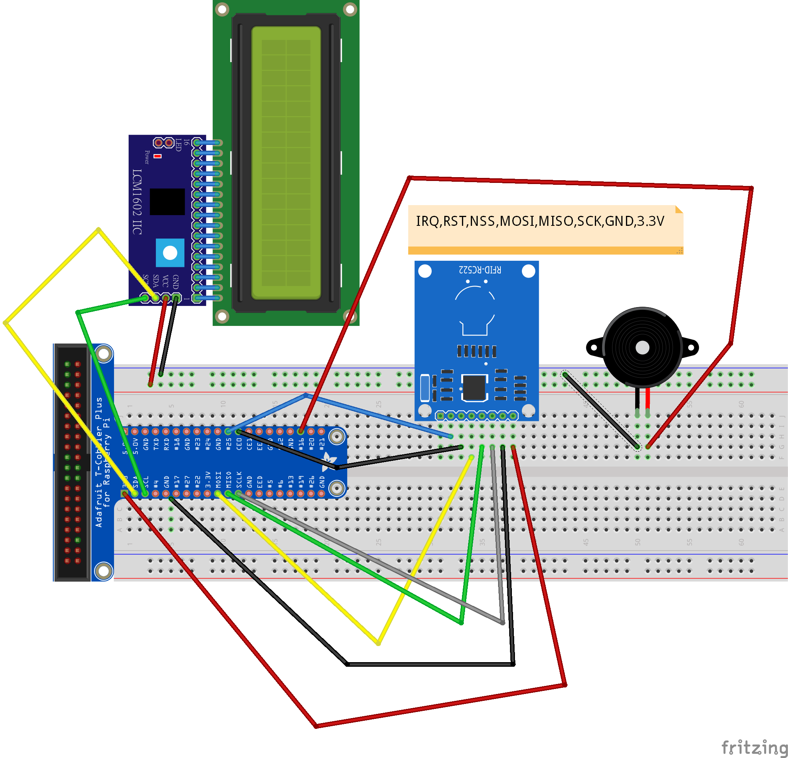
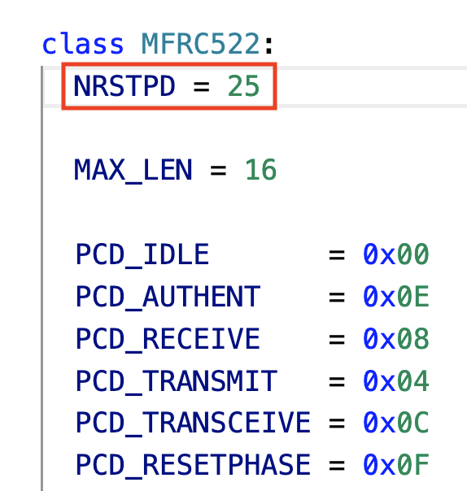
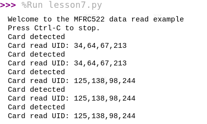

# RFID 和 LCD 和 蜂鳴器

## 線路圖

### [LCD設定的網址](https://sites.google.com/site/zsgititit/home/raspberry-shu-mei-pai/raspberry-shi-yongi2c-kong-zhi2x16lcd)

## Raspberry使用 I2C 控制2*16 LCD
1. Raspberry啟用i2c
2. 連接Raspberry與LCD

| LCD | Raspberry Pi |
|:--|:--|
| Vcc | 5V |
| Gnd | Gnd |
| SDA | SDA |
| SCL | SCL |

3. 檢查Raspberry的i2c是否有連結到2x16LCD,並查尋address

```
$ i2cdetect -y l

結果:================
位址為:0x27
```


4. 下載Python[驅動程式](https://github.com/paulbarber/raspi-gpio)

```
$ git clone  https://github.com/paulbarber/raspi-gpio
$ cd raspi-gpio
$ vim lcd_display.py
將ADDRESS修改為0x27
```

5.python測試

```python
from lcd_display import lcd

my_lcd = lcd()
my_lcd.display_string("Raspberry Pi", 1)
my_lcd.display_string("Hello", 2)
```

### Raspberry 設定 RFID

#### 1. 在目錄的MFRC522.PY已經是Python3.0版
#### 2. pip install MFRC522(在虛擬環境安裝,不需要打.py)

- MFRC522 module 在虛擬環境是小寫mfrc522

#### 3. 更改MFRC522.py內,MFRC522 class 的 NRSTPD = 25

- 依據接線,目前的線路RST是25
	
	
#### 4. 開啟raspberry的SPI介面

```
$ sudo raspi-config
```

#### 4. 安裝支援SPI的libraries

```
$ sudo apt-get install python3-spidev
```

#### 5. 安裝SPI-Py,會安裝在global

```
$ cd ~
$ git clone https://github.com/lthiery/SPI-Py.git
$ cd SPI-Py
#會安裝在global
$ sudo python3 setup.py install

#安裝在虛擬環境內
$ python3 setup.py install

```


#### 6.測試硬體，請先使用ready.py進行測試



```
#!/usr/bin/env python
# -*- coding: utf8 -*-
#
#    Copyright 2014,2018 Mario Gomez <mario.gomez@teubi.co>
#
#    This file is part of MFRC522-Python
#    MFRC522-Python is a simple Python implementation for
#    the MFRC522 NFC Card Reader for the Raspberry Pi.
#
#    MFRC522-Python is free software: you can redistribute it and/or modify
#    it under the terms of the GNU Lesser General Public License as published by
#    the Free Software Foundation, either version 3 of the License, or
#    (at your option) any later version.
#
#    MFRC522-Python is distributed in the hope that it will be useful,
#    but WITHOUT ANY WARRANTY; without even the implied warranty of
#    MERCHANTABILITY or FITNESS FOR A PARTICULAR PURPOSE.  See the
#    GNU Lesser General Public License for more details.
#
#    You should have received a copy of the GNU Lesser General Public License
#    along with MFRC522-Python.  If not, see <http://www.gnu.org/licenses/>.
#

import RPi.GPIO as GPIO
import mfrc522 as MFRC522
import signal

continue_reading = True

# Capture SIGINT for cleanup when the script is aborted
def end_read(signal,frame):
    global continue_reading
    print ("Ctrl+C captured, ending read.")
    continue_reading = False
    GPIO.cleanup()

# Hook the SIGINT
signal.signal(signal.SIGINT, end_read)

# Create an object of the class MFRC522
MIFAREReader = MFRC522.MFRC522()

# Welcome message
print ("Welcome to the MFRC522 data read example")
print ("Press Ctrl-C to stop.")

# This loop keeps checking for chips. If one is near it will get the UID and authenticate
while continue_reading:
    
    # Scan for cards    
    (status,TagType) = MIFAREReader.MFRC522_Request(MIFAREReader.PICC_REQIDL)

    # If a card is found
    if status == MIFAREReader.MI_OK:
        print ("Card detected")
    
    # Get the UID of the card
    (status,uid) = MIFAREReader.MFRC522_Anticoll()

    # If we have the UID, continue
    if status == MIFAREReader.MI_OK:

        # Print UID
        print ("Card read UID: %s,%s,%s,%s" % (uid[0], uid[1], uid[2], uid[3]))
    
        # This is the default key for authentication
        key = [0xFF,0xFF,0xFF,0xFF,0xFF,0xFF]
        
        # Select the scanned tag
        MIFAREReader.MFRC522_SelectTag(uid)

        # Authenticate
        status = MIFAREReader.MFRC522_Auth(MIFAREReader.PICC_AUTHENT1A, 8, key, uid)

        # Check if authenticated
        if status == MIFAREReader.MI_OK:
            MIFAREReader.MFRC522_Read(8)
            MIFAREReader.MFRC522_StopCrypto1()
        else:
            print ("Authentication error")


```

#### RFID 和 Firebase

```python
import RPi.GPIO as GPIO
import mfrc522 as MFRC522
from tkinter import *
import sys
import threading
import firebase_admin
from firebase_admin import credentials
from firebase_admin import firestore
import time
import datetime

def on_closing():
    print("ctrl+c captured, ending read.")
    GPIO.cleanup()
    sys.exit(0)

class App():
    def __init__(self,window):
        #init fireStore
        cred = credentials.Certificate('firebase_key/raspberryfirebase-firebase-adminsdk-y4f0x-e21c25a365.json')
        firebase_admin.initialize_app(cred)
        self.firestore = firestore.client()

        
        #init Rfid
        self.previousUid = []
        self.MIFAREReader = MFRC522.MFRC522()
        self.rfidStatusHandler()


    def rfidStatusHandler(self):
        (status, TagType) = self.MIFAREReader.MFRC522_Request(self.MIFAREReader.PICC_REQIDL)
        if status == self.MIFAREReader.MI_OK:
            print("status success")            
            self.cardRuning()     
            
        threading.Timer(3, self.rfidStatusHandler).start()

    def cardRuning(self):
        (status, currentUid) = self.MIFAREReader.MFRC522_Anticoll()
        if status == self.MIFAREReader.MI_OK and set(currentUid) != set(self.previousUid):
            self.previousUid = currentUid
            cardCode = ""
            for singleId in currentUid:
                cardCode += "{:x}.".format(singleId)

            print(cardCode)
            self.saveToFireStore(cardCode)

    def saveToFireStore(self,cardCode):
        doc_ref = self.firestore.collection('Doors').document()
        currentTime = time.time()
        timestamp = datetime.datetime.fromtimestamp(currentTime)
        date = timestamp.strftime("%Y-%m-%d-%H-%M-%S")
        print(date)
        doc_ref.set({
            'timestamp':timestamp,
            'cardID': cardCode,
            'date':date
        })

if __name__ == "__main__":
    GPIO.setwarnings(False);
    root = Tk()
    root.title("RFID_LCD")
    root.protocol("WM_DELETE_WINDOW",on_closing)
    app = App(root)
    root.mainloop()
```

#### RFID TKinter Firebase


```python
import threading
import firebase_admin
from firebase_admin import credentials
from firebase_admin import firestore
import datetime
import time

import tkinter as tk
from tkinter import ttk 
import RPi.GPIO as GPIO
import sys
import mfrc522 as MFRC522


class Window(tk.Tk):
    def __init__(self):
        super().__init__()
        #---------------Firebase realtime database 初始化---------------
        cred = credentials.Certificate("firebase_key/raspberryfirebase-firebase-adminsdk-y4f0x-e21c25a365.json")
        firebase_admin.initialize_app(cred)
        self.firestore = firestore.client()

        #----------------init Rfid--------------------------
        self.previousUid = []
        self.MIFAREReader = MFRC522.MFRC522()
        self.rfidStatusHandler()
        
        

        #-----------建立tkinter----------------------        
        self.title("python視窗和FireStore資料庫")
        mainFrame  = tk.Frame(self, relief="groove", borderwidth=2)
        titleFrame = tk.Frame(mainFrame)
        tk.Label(titleFrame,text="python視窗和FireStore資料庫\n\nRFID系統",font=("Arial",15),fg="#555555").pack(padx=10)
        titleFrame.pack(pady=30)
        mainFrame.pack(pady=30,padx=30,ipadx=30,ipady=30) 
        
        #-------------建立labelFrame-------------------
        labelFrame = tk.Frame(mainFrame,width=50)        
        
        self.num1Label = tk.Label(labelFrame,text='00',font=("Arial",15))
        self.num1Label.pack(side=tk.LEFT,padx=(0,5))

        self.num2Label = tk.Label(labelFrame,text='00',font=("Arial",15))
        self.num2Label.pack(side=tk.LEFT,padx=(0,5))

        self.num3Label = tk.Label(labelFrame,text='00',font=("Arial",15))
        self.num3Label.pack(side=tk.LEFT,padx=(0,5))

        self.num4Label = tk.Label(labelFrame,text='00',font=("Arial",15))
        self.num4Label.pack(side=tk.LEFT,padx=(0,5))

        self.num5Label = tk.Label(labelFrame,text='00',font=("Arial",15))
        self.num5Label.pack(side=tk.LEFT,padx=(0,5))       
        labelFrame.pack(pady=10)
       
        #-----------------建立TreeView-----------------------
        columns = ['#1','#2','#3','#4','#5','#6']
        self.tree = ttk.Treeview(self, columns=columns, show='headings')
        self.tree.heading('#1',text='時間')
        self.tree.heading('#2',text='號碼1')
        self.tree.heading('#3',text='號碼2')
        self.tree.heading('#4',text='號碼3')
        self.tree.heading('#5',text='號碼4')
        self.tree.heading('#6',text='號碼5')       
        self.tree.column('#1',width=200)
        self.tree.column('#2',width=50)
        self.tree.column('#3',width=50)
        self.tree.column('#4',width=50)
        self.tree.column('#5',width=50)
        self.tree.column('#6',width=50)        
        self.tree.pack()
        #建立realtime update
        self.callback_done = threading.Event()
        ##每次只取得最新的10筆
        query_ref = self.firestore.collection('Doors').order_by('date',direction=firestore.Query.DESCENDING).limit(10)       
        ##註冊callback
        col_watch = query_ref.on_snapshot(self.on_snapshot)

    def on_snapshot(self,doc_snapshot, changes, read_time):
        # 清除tree內容
        for i in self.tree.get_children():
            self.tree.delete(i) 
        #這是firestore的callback,doc_snapshot參數是list,只有10筆,順序必需相反   
        doc_snapshot.reverse()   
        for doc in doc_snapshot:
            print(doc.__class__)
            print(f'接收到的資料:{doc.id}')
            #更新treeView資料
            data_time = doc.get('date')          
            numsString = doc.get('cardID')
            nums = numsString.split('.')
            self.tree.insert('',tk.END,values=[data_time] + nums)
        self.callback_done.set()


    
    def rfidStatusHandler(self):
        (status, TagType) = self.MIFAREReader.MFRC522_Request(self.MIFAREReader.PICC_REQIDL)
        if status == self.MIFAREReader.MI_OK:
            print("status success")            
            self.cardRuning()     
            
        threading.Timer(3, self.rfidStatusHandler).start()
    
    def cardRuning(self):
        (status, currentUid) = self.MIFAREReader.MFRC522_Anticoll()
        if status == self.MIFAREReader.MI_OK and set(currentUid) != set(self.previousUid):
            self.previousUid = currentUid
            cardCode = ""
            self.num1Label.configure(text=f'{currentUid[0]:x}')
            self.num2Label.configure(text=f'{currentUid[1]:x}')
            self.num3Label.configure(text=f'{currentUid[2]:x}')
            self.num4Label.configure(text=f'{currentUid[3]:x}')
            self.num5Label.configure(text=f'{currentUid[4]:x}')
            for singleId in currentUid:
                cardCode += "{:x}.".format(singleId)
                

            print(cardCode)
            self.saveToFireStore(cardCode)

    def saveToFireStore(self,cardCode):
        doc_ref = self.firestore.collection('Doors').document()
        currentTime = time.time()
        timestamp = datetime.datetime.fromtimestamp(currentTime)
        date = timestamp.strftime("%Y-%m-%d-%H-%M-%S")
        print(date)
        doc_ref.set({
            'timestamp':timestamp,
            'cardID': cardCode,
            'date':date
        })    
        
        


    
def closeWindow():    
    GPIO.cleanup()
    sys.exit(0)
    window.destroy()

if __name__ == "__main__":
    window = Window()
    window.resizable(width=0,height=0)
    window.protocol("WM_DELETE_WINDOW",closeWindow)
    window.mainloop()

```

#### RFID LCD Firebase

```python
from LCD.lcd_display import lcd
import RPi.GPIO as GPIO
import mfrc522 as MFRC522
from tkinter import *
import sys
import threading
import firebase_admin
from firebase_admin import credentials
from firebase_admin import firestore
import time
import datetime

def on_closing():
    print("ctrl+c captured, ending read.")
    GPIO.cleanup()
    sys.exit(0)

class App():
    def __init__(self,window):
        #init fireStore
        cred = credentials.Certificate('/home/pi/Documents/certificate/raspberryfirebase-firebase-adminsdk-y4f0x-cf4be2ca1a.json')
        firebase_admin.initialize_app(cred)
        self.firestore = firestore.client()

        #init lcd
        self.my_lcd = lcd()


        #init Rfid
        self.previousUid = []
        self.MIFAREReader = MFRC522.MFRC522()
        self.rfidStatusHandler()


    def rfidStatusHandler(self):
        (status, TagType) = self.MIFAREReader.MFRC522_Request(self.MIFAREReader.PICC_REQIDL)
        if status == self.MIFAREReader.MI_OK:
            print("status success")
            self.my_lcd.display_string("status success", 1)
            self.my_lcd.display_string("..........", 2)
            self.cardRuning()
        else:
            self.my_lcd.display_string("Put On Card", 1)
            self.my_lcd.display_string("..........", 2)

        threading.Timer(3, self.rfidStatusHandler).start()

    def cardRuning(self):
        (status, currentUid) = self.MIFAREReader.MFRC522_Anticoll()
        if status == self.MIFAREReader.MI_OK and set(currentUid) != set(self.previousUid):
            self.previousUid = currentUid
            cardCode = ""
            for singleId in currentUid:
                cardCode += "{:x}.".format(singleId)

            self.my_lcd.display_string("Card ID:", 1)
            self.my_lcd.display_string(cardCode.upper(), 2)
            print(cardCode)
            self.saveToFireStore(cardCode)

    def saveToFireStore(self,cardCode):
        doc_ref = self.firestore.collection('Doors').document()
        currentTime = time.time()
        timestamp = datetime.datetime.fromtimestamp(currentTime)
        date = timestamp.strftime("%Y-%m-%d-%H-%M-%S")
        print(date)
        doc_ref.set({
            'timestamp':timestamp,
            'cardID': cardCode,
            'date':date
        })


    
    

if __name__ == "__main__":
    GPIO.setwarnings(False);
    root = Tk()
    root.title("RFID_LCD")
    root.protocol("WM_DELETE_WINDOW",on_closing)
    app = App(root)
    root.mainloop()

```

#### RFID LCD Buzzer Firebase

```python
import RPi.GPIO as GPIO
from raspigpio.lcd_display import lcd
from tkinter import *
import mfrc522 as MFRC522
import threading
import sys
from time import sleep, time
import datetime
from gpiozero import Buzzer
import firebase_admin
from firebase_admin import credentials
from firebase_admin import firestore

class App():
    def __init__(self,window):
        
        #初始化lcd
        self.my_lcd = lcd()

        #初始化buzzer
        self.my_buzzer = Buzzer(16)

        #初始化RFID
        self.previousUid = []
        self.MIFAREReader= MFRC522.MFRC522()
        self.rfidStatusHandler()

        #初始化firestore
        cred = credentials.Certificate("/home/pi/raspberryfirebase-firebase-adminsdk-y4f0x-ce1ddd9e4b.json")
        firebase_admin.initialize_app(cred,{
            'databaseURL': 'https://raspberryfirebase.firebaseio.com/'
            })
        self.firestore = firestore.client()

        

        
    
    def rfidStatusHandler(self):
        (status, tagType)= self.MIFAREReader.MFRC522_Request(self.MIFAREReader.PICC_REQIDL)
        if status == self.MIFAREReader.MI_OK:
            print("Find Card")
            self.my_lcd.display_string("Find Card",1)
            self.my_lcd.display_string("......",2)
           
            self.cardRuning()  

        else:
            print("Put Car on It")
            self.my_lcd.display_string("Put Car on It",1)
            self.my_lcd.display_string("",2)
         
        threading.Timer(0.5, self.rfidStatusHandler).start()
    
    def cardRuning(self):
        (status, currentUid) = self.MIFAREReader.MFRC522_Anticoll()
        if status == self.MIFAREReader.MI_OK and currentUid != self.previousUid:
             #buzzer sound()
            self.my_buzzer.on()
            sleep(0.2)
            self.my_buzzer.off()

            self.previousUid = currentUid
            print(currentUid)
            cardCode=""
            for singleId in currentUid:
                cardCode += "{:x}.".format(singleId)
            self.my_lcd.display_string("Card ID",1)
            self.my_lcd.display_string(cardCode.upper(),2)
            print(cardCode)
            self.saveToFireStore(cardCode)
    
    def saveToFireStore(self,cardCode):
        doc_ref = self.firestore.collection('Doors').document()
        currentTime = time()
        timestamp = datetime.datetime.fromtimestamp(currentTime)
        date = timestamp.strftime("%Y-%m-%d-%H-%M-%S")
        doc_ref.set({
            'timesamp':timestamp,
            'cardID':cardCode,
            'date':date
        })


def on_closing():
    GPIO.cleanup()
    root.destroy()
    sys.exit()

if __name__ == "__main__":
    GPIO.setwarnings(False)
    root = Tk()
    root.protocol("WM_DELETE_WINDOW", on_closing)
    app = App(root)
    root.mainloop()

```


