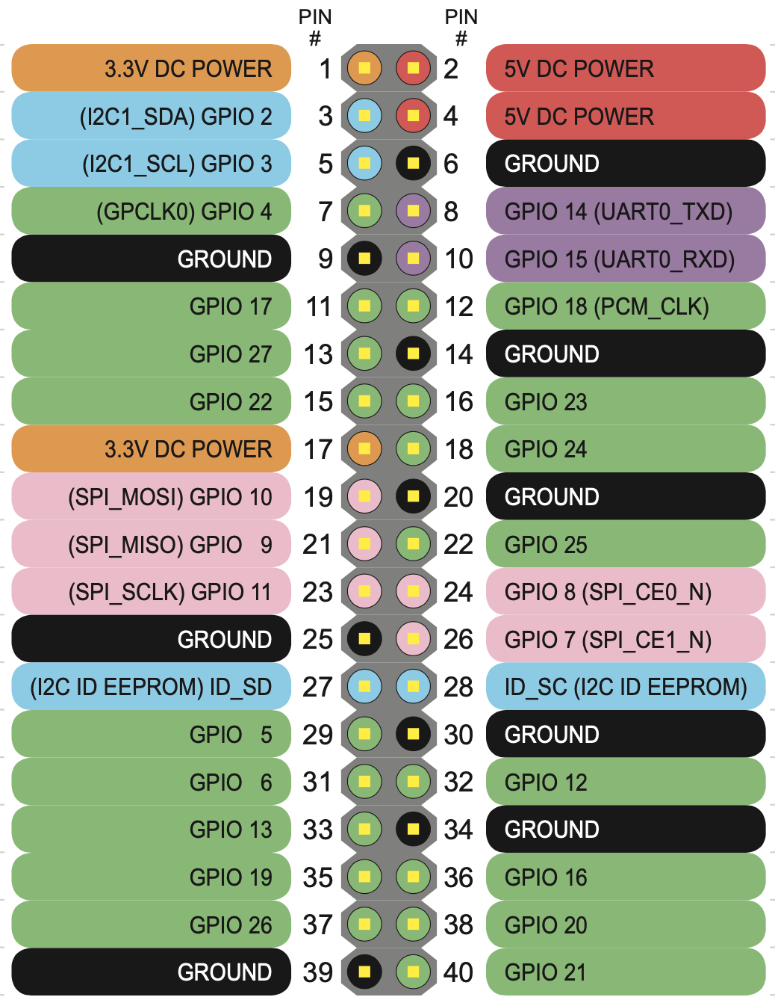

# Raspberry

預設帳號:pi

預設密碼:raspberry

# 目錄
## [系統安裝](./目錄/系統安裝)
- 沒有RaspberryPi硬體的解決方案
- 下載Raspberry Pi OS

## [遠端連線raspberry](./目錄/遠端連線raspberry)
- 從序列埠連線至Raspberry(必需要有TTL線)
- 查詢Raspberry的 ip Address 
- PC 透過SSH連線至Raspberry  
- Mac 透過SSH連線至Raspberry
- 設定raspberry環境 
- 使用遠端桌面(Microsoft Remote Desktop) 

## [命令列](./目錄/命令列)
- 建立github SSH keys
- 使用SSH學習命令列 
- 使用apt-get安裝和移除軟體
- 安裝vim文字編輯器

## 安裝軟體工具
- [安裝python3.x](#install_python)
- [安裝condamini和jupyter(要用jupyter一定必需使用condamini)](#安裝condamini和jupyter)

### 建立虛擬環境
- [使用Conda建立python的虛擬環境](#使用Conda建立python的虛擬環境)

### 可以安裝至樹莓派內的程式編輯器
- [安裝pycharm comunity editor for respberry4 2GB 以上](#install_pycharm)
- [安裝vscode](#install_vscode)

## 雲端服務
- [Firebase](./Firebase)
- [Blynk](./Blynk/LEDControl)
- [ifttt](./ifttt/)
- [thingSpeak](./thingSpeak)

## GPIO 操控
- [Raspberry的40pin](#Raspberry的40pin)
- [硬體一覽表](./硬體一覽表)
- [tkinter](https://github.com/roberthsu2003/pythonWindow)
- [1.led Control](./Firebase_GPIO_tkinter/1LEDControl)
- [2.PWM LED](./Firebase_GPIO_tkinter/2PWMLed)
- [3.RGB LED](./Firebase_GPIO_tkinter/3RGBLed)
- [4.Button RGBLED](./Firebase_GPIO_tkinter/4Button_RGBLED)
- [5.MCP3008 光敏電阻 LM35](./Firebase_GPIO_tkinter/5MCP3008)
- [6.Servo](./Firebase_GPIO_tkinter/6servo)
- [7.7段顯示器](./Firebase_GPIO_tkinter/7seven_segment_display)
- [8.LCD_RFID](./Firebase_GPIO_tkinter/8LCD_RFID)
- [9.Camera](./Firebase_GPIO_tkinter/9Camera)
- [10.臉部辦識](./Firebase_GPIO_tkinter/10facial_recognition)
- [自動執行程式](#autoRunProgram)  


<a name="install_python"></a>
## 安裝python 3.x

### 檢查目前預設python,python3版本
`$ python --version`

`$ python3 --version`

### 檢查執行那一個python
`$ which python`

`$ which python3`

### 安裝python3

```
$ sudo apt update
$ sudo apt install python3
```


<a name=“install_python”></a>
## 安裝python

```
#檢查python版本
$ python —version

#目前python的路徑
$ which python

#安裝python3
$ sudo apt-get inatll python3

#更改環境設定
$ sudo vim ~/.bashrc
# 在最後一行加上
export PATH=“/usr/bin:$PATH”
```


<a name="安裝condamini和jupyter"></a>
## 安裝miniconda和jupyter

### 步驟 1:下載miniconda
	$ wget http://repo.continuum.io/miniconda/Miniconda3-latest-Linux-armv7l.sh

### 步驟2:安裝miniconda
一開始會出現License ，一直按enter會出現問你是否同意Licence，輸入yes。

會問你要安裝在預設路徑 /root/minconda3，或其他地方。我是安裝到此處:
/home/pi/miniconda3

會問你要不要加入PATH，先輸入no，下步驟再加入PATH

	$ sudo /bin/bash Miniconda3-latest-Linux-armv7l.sh
	
### 步驟3:設定PATH

	$ sudo nano /home/pi/.bashrc

在檔案最尾端加入下方文字後存檔

	export PATH=”/home/pi/miniconda3/bin:$PATH”
	
重新執行.bashrc

	$ source ~/.bashrc
	
步驟4:更改miniconda3下的所有檔案及目錄，為pi的擁有者

	$ sudo chown -R pi miniconda3
	
步驟 5:安裝python，會問是否同意安裝，按y

	#修改conda的預設檔,告知要使用的硬體是rpi
	conda config —add channels rpi
	
	#查詢conda提供的python版本 conda search "^python$"
	conda install python=3.6
	
步驟 6:安裝Jupyter notebook

	$ conda install jupyter
	
步驟 7:測試

	$ python -V
	$ which python
	
步驟 8:開啟jupyter

	$jupyter notebook
	
<a name="使用Conda建立python的虛擬環境"></a>
## 使用Conda建立python的虛擬環境
- 安裝numpy, pandas, matplotlib
- 安裝gpio套件

### 1.檢查conda版本
	$ conda -V
	conda 4.5.11
	
### 2.更新conda
	$ conda update conda
	
### 3.建立python虛擬環境
	#檢查conda提供的python版本
	$ conda search "^python$" 
	
	#建立一個虛擬環境env01, x.x為要安裝的版本
	$ conda create -n env01 python=x.x
	
### 4.啟動conda虛擬環境

	$ source activate env01

	#查看目前所有conda的虛擬環境
	conda info -e
	
### 5.使用conda安裝python package
	$ conda install -n env01 numpy
	$ conda install -n env01 pandas
	$ conda install -n env01 matplotlib
	
### 6.安裝gpio需要的套件

	(envo1)$ pip install RPI.GPIO
	(envo1)$ pip install gpiozero

### 7.離開conda的虛擬環境
	$source deactivate
	
### 8. 刪除虛擬環境
	$ conda remove -n env01 -all
	
<a name="install_pycharm"></a>
## 安裝pycharm comunity editor for respberry4 2GB 以上

## 更新jdp
```
$ sudo apt update
$ sudo apt install default-jdk
```
### 下載pycharm
```
https://www.jetbrains.com/pycharm/download/
```

## 安裝vscode
```
$ sudo su
$ . <( wget -O - https://code.headmelted.com/installers/apt.sh )
$ exit
```

### 解壓縮,並copy 至 /opt 目錄
```
sudo mv pycharm-community-2020.x.x /opt/pycharm-community-2020.x.x
```

### 執行pycharm.sh

```
./bin/pycharm.sh
```


<a name="Raspberry的40pin"></a>
## Raspberry的40pin



<a name=autoRunProgram></a>	
## 自動執行程式

### 啟動時自動執行應用程式

```
sudo nano /etc/rc.local

在最後一行加入
$ /usr/bin/python /home/pi/my_program.py &
```

	
