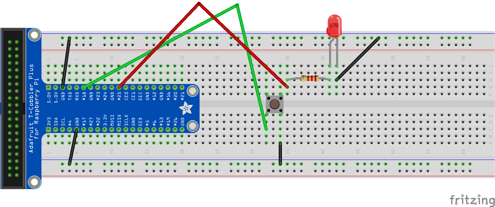
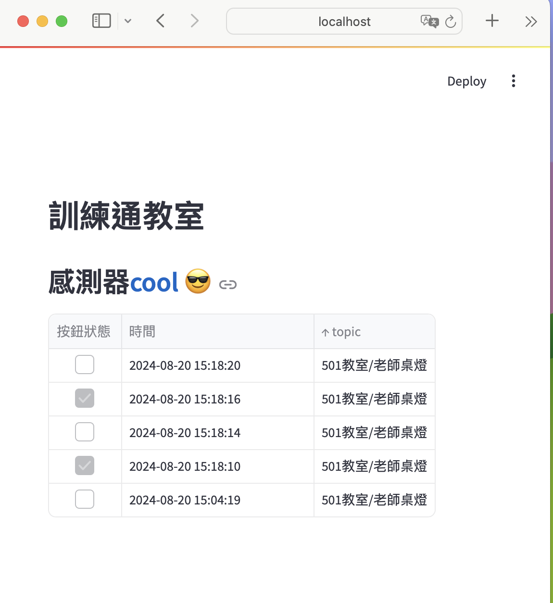

## 1. LED_BUTTON
- **MQTT的發佈和訂閱**
- **MQTT的訂閱必需有密碼**
- **MQTT的publish必需要有密碼**
- **MQTT的publish的資料必需是json格式**
- **收到的資料儲存為csv**
- **收到的資料儲存至雲端Render Redis**
- **本地端Web頁面顯示**
- **雲端Web頁面顯示**
- **建立啟動3個python專案的shell**
## 2. 線路


## 3. 以下程式參考此資料夾專案檔案
### 3.1 使用miniforge建立虛擬環境


### 3.2 requirements.txt

```
redis
RPi.GPIO
lgpio
gpiozero
paho-mqtt
python-dotenv
streamlit
pandas
streamlit-autorefresh
```

### 3.3 .env

```
REDIS_HOST=127.0.0.1
REDIS_PASSWORD=raspberry
MQTT_SERVER=127.0.0.1
MQTT_USERNAME=pi
MQTT_PASSWORD=raspberry
RENDER_REDIS=rediss://xxxxxxxxxxxxxxxxxxxxxxxxxxxxxxx:6379
```

### 3.4 tools套件內的file模組
- 目地建立csv檔
- file.py

```
import os.path
import os
from datetime import datetime
import random

def created_log_file(file:str,folder:str='data')->str:
    current_path = os.path.abspath(__name__) #取得目前檔案路徑
    directory_name = os.path.dirname(current_path) #取得目前資料夾路行
    data_path = os.path.join(directory_name,folder) #目前資料夾路徑加上data目錄
    if not os.path.isdir(data_path):
        print(f"沒有{folder}的目錄,手動建立目錄")
        os.mkdir(data_path)
    else:
        print("目錄已經建立")
    
    log_path = os.path.join(data_path,file)
    if not os.path.isfile(log_path):
        print(f"沒有{file}檔,建立新檔")
        with open(log_path,mode='w',encoding='utf-8',newline='') as file:
            file.write('topic,時間,狀態\n')
        
    else:
        print("已經有log檔")
    
    return log_path
    

def record_info(log_path:str,topic:str,date:str,status:str): 
    with open(log_path,mode='a',encoding='utf-8',newline='') as file:
        file.write(topic + ',' + date + ',' + status + "\n")
```

### 3.5 發佈(publish)
- button1.py

```python
import signal
from gpiozero import Button,LED
from datetime import datetime
import paho.mqtt.publish as publish
from dotenv import load_dotenv
import os
load_dotenv()

def user_release():
    print("使用者按下放開")
    led.toggle()
    now = datetime.now()
    now_str = now.strftime('%Y-%m-%d %H:%M:%S')
    print(now_str)
    if led.is_lit:
        message = f'''{{
            "status":"true",
            "date":"{now_str}",
            "topic":"501教室/老師桌燈"
        }}'''
        print(message)
        #要加入username和password
        publish.single(topic='501教室/老師桌燈',payload=message,hostname='127.0.0.1',qos=2,auth={'password':os.environ['MQTT_PASSWORD'],'username':os.environ['MQTT_USERNAME']})
    else:
        message = f'''{{
            "status":"false",
            "date":"{now_str}",
            "topic":"501教室/老師桌燈"
        }}''' 
        print(message)
        publish.single(topic='501教室/老師桌燈',payload=message,hostname='127.0.0.1',qos=2,auth={'password':os.environ['MQTT_PASSWORD'],'username':os.environ['MQTT_USERNAME']})

if __name__ == '__main__':
    button = Button(pin=18)
    button.when_released = user_release
    led = LED(pin=25) 
    signal.pause()

```

### 3.6 訂閱(subscript)
- receive.py
- 
```
import paho.mqtt.client as mqtt
import redis
from dotenv import load_dotenv
import os
from tools.file import created_log_file,record_info
import json
from datetime import datetime
load_dotenv()

redis_conn = redis.Redis(host=os.environ['REDIS_HOST'], port=6379,password=os.environ['REDIS_PASSWORD'])
render_redis_conn = redis.Redis.from_url(os.environ['RENDER_REDIS'])


#MQTT接收訊息的callback
def on_message(mosq, obj, msg):
    topic = msg.topic
    message = msg.payload.decode('utf-8')#預設是binary str,轉換為str
    redis_conn.rpush(topic,message) #儲存在本機端redis
    render_redis_conn.rpush(topic,message)#儲存在render server的redis
    #解析json文字檔
    message_dict = json.loads(message)
    print(message)
    #儲存檔案
    now = datetime.now()
    current_file_name = now.strftime('%Y_%m_%d.log')
    log_path = created_log_file(current_file_name)
    record_info(log_path,message_dict['topic'],message_dict['date'],str(message_dict['status']))


    print(f"topic={topic},message:{message}")

if __name__ == '__main__':
    #MQTT建立subscribe
    client = mqtt.Client(mqtt.CallbackAPIVersion.VERSION2)
    client.username_pw_set(os.environ['MQTT_USERNAME'],os.environ['MQTT_PASSWORD']) #加入username和password
    client.on_message = on_message
    client.connect(os.environ['MQTT_SERVER'])
    client.subscribe('501教室/老師桌燈',qos=2)
    client.loop_forever()
```

### 3.7 本地端網頁顯示
- 使用streamlit
- 資料來源為本地端redis server
- webUI.py

```python
import streamlit as st
import redis
import os
import json
from dotenv import load_dotenv
import pandas as pd
from streamlit_autorefresh import st_autorefresh

load_dotenv()
st_autorefresh()
conn = redis.Redis(host=os.environ['REDIS_HOST'],port=6379,password=os.environ['REDIS_PASSWORD'])
bytes_list = conn.lrange('501教室/老師桌燈',-5,-1) #取得的資料為list內有bytes string
str_list = [bytes_str.decode('utf-8') for bytes_str in reversed(bytes_list)] #將bytes string轉換為str
dict_list = [json.loads(string) for string in str_list] #將字串轉為python的資料結構
df1 = pd.DataFrame(dict_list) #建立DataFrame
st.title("訓練通教室")
st.header("感測器:blue[cool] :sunglasses:")
st.dataframe(df1,
             hide_index=True,
             column_config={
                 "status":st.column_config.CheckboxColumn(label='按鈕狀態',width='small'),
                 "date":st.column_config.DatetimeColumn(label='時間',width='medium')
                 })
```



### 3.8 建立啟動3個專案的shell
- start.sh必需建立在專案資料夾內

```bash
#!/bin/bash
#進入腳本所有目錄
cd "$(dirname "$0")"

#進入venv1
source ~/miniforge3/etc/profile.d/conda.sh
conda activate venv1

#執行python程式,一次啟動3個,必需要有&連結
python button1.py &
python receive.py &
streamlit run webUI.py &
```

### 3.9 建立啟動時,自動執行start.sh

```bash
$crontab -e #編輯cron
```

- 增加以下一行

```
#開機時自動執行,並把執行輸出的文字儲存至/tmp/cron_test.log
#2>&1
#這部分將標準錯誤輸出（錯誤訊息）也重定向到標準輸出（1），然後一起寫入到日誌檔案中。2 代表標準錯誤，1 代表標準輸出，>& 表示將 2 重定向到 1。

@reboot /home/pi/Documents/GitHub/xxxxxxx/start.sh >> /tmp/cron_test.log 2>&1
```

### 3.10 建立雲端web service
- 新增web資料夾
- 新增requirements.txt
- 修改webUI.py

#### 3.10.1 **requirements.txt**

```
redis
paho-mqtt
python-dotenv
streamlit
pandas
streamlit-autorefresh
```

#### 3.10.2 webUI.py

```
import streamlit as st
import redis
import os
import json
from dotenv import load_dotenv
import pandas as pd
from streamlit_autorefresh import st_autorefresh

load_dotenv()
st_autorefresh()
#conn = redis.Redis(host=os.environ['REDIS_HOST'],port=6379,password=os.environ['REDIS_PASSWORD'])
conn = redis.Redis.from_url(url=os.environ['RENDER_REDIS'])
bytes_list = conn.lrange('501教室/老師桌燈',-5,-1) #取得的資料為list內有bytes string
str_list = [bytes_str.decode('utf-8') for bytes_str in reversed(bytes_list)] #將bytes string轉換為str
dict_list = [json.loads(string) for string in str_list] #將字串轉為python的資料結構
df1 = pd.DataFrame(dict_list) #建立DataFrame
st.title("訓練通教室")
st.header("感測器:blue[cool] :sunglasses:")
st.dataframe(df1,
             hide_index=True,
             column_config={
                 "status":st.column_config.CheckboxColumn(label='按鈕狀態',width='small'),
                 "date":st.column_config.DatetimeColumn(label='時間',width='medium')
                 })


```

#### 3.10.3 上傳至Render


