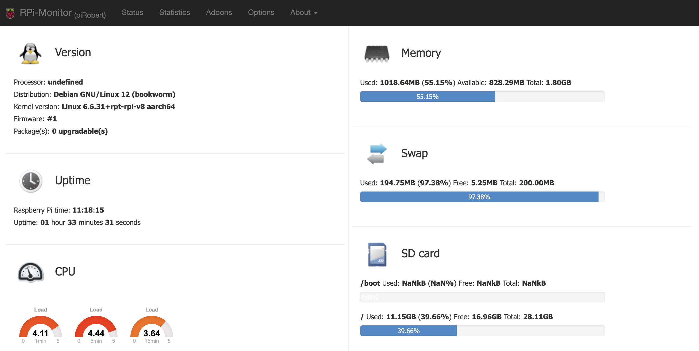

## 使用指令htop
```
$ htop
```
## RPI-Monitor
RPI-Monitor 是一個方便的工具，可以用來監控你的 Raspberry Pi 的健康狀況和性能。以下是在 Raspberry Pi 上安裝和使用 RPI-Monitor 的逐步指南：

### 安裝

1. **更新系統**：
   首先，更新軟件包列表並升級現有軟件包：
   
   ```bash
   sudo apt-get update
   sudo apt-get upgrade
   ```

2. **添加 RPI-Monitor 軟件庫**：
   將 RPI-Monitor 軟件庫添加到系統的軟件源：
   
   ```bash
   sudo apt-key adv --recv-keys --keyserver keyserver.ubuntu.com 2C0D3C0F
   echo "deb http://giteduberger.fr rpimonitor/" | sudo tee /etc/apt/sources.list.d/rpimonitor.list
   ```

3. **安裝 RPI-Monitor**：
   使用包管理器安裝 RPI-Monitor：
   
   ```bash
   sudo apt-get update
   sudo apt-get install rpimonitor
   ```

4. **啟動 RPI-Monitor**：
   安裝完成後，啟動 RPI-Monitor 服務：
   
   ```bash
   sudo service rpimonitor start
   ```

5. **設置開機自動啟動 RPI-Monitor**：
   確保 RPI-Monitor 在開機時自動啟動：
   
   ```bash
   sudo systemctl enable rpimonitor
   ```

### 使用

1. **訪問 RPI-Monitor**：
   打開一個網頁瀏覽器，導航到以下地址以訪問 RPI-Monitor 網頁界面：
   
   ```
   http://<Your_Raspberry_Pi_IP_Address>:8888
   ```
   將 `<Your_Raspberry_Pi_IP_Address>` 替換為你的 Raspberry Pi 的實際 IP 地址。你可以使用以下命令找到你的 Raspberry Pi 的 IP 地址：
   
   ```bash
   hostname -I
   ```

2. **監控你的 Raspberry Pi**：
   RPI-Monitor 界面將提供有關各種系統參數的實時信息，包括 CPU 溫度、CPU 使用率、內存使用率、磁盤使用率、網絡流量等。

### 自定義

RPI-Monitor 可以自定義以顯示額外的信息或調整現有的參數：

1. **配置文件**：
   主要的配置文件位於 `/etc/rpimonitor/`。你可以通過複製和編輯這些文件來創建自定義配置。

2. **插件和模板**：
   你可以添加自定義插件和模板來監控額外的指標或以不同的格式顯示數據。詳情請查看 [RPI-Monitor GitHub repository](https://github.com/XavierBerger/RPi-Monitor) 了解插件和自定義的更多信息。

### 更新 RPI-Monitor

為了確保你擁有最新版本的 RPI-Monitor，定期使用以下命令進行更新：
```bash
sudo apt-get update
sudo apt-get install rpimonitor
```

按照這些步驟，你可以有效地安裝、配置和使用 RPI-Monitor 來監控你的 Raspberry Pi 的性能和健康狀況。



