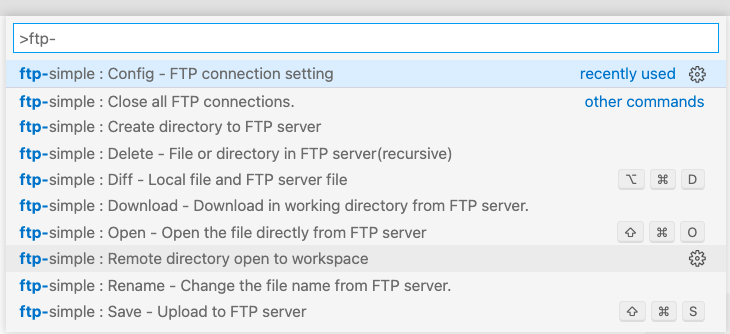
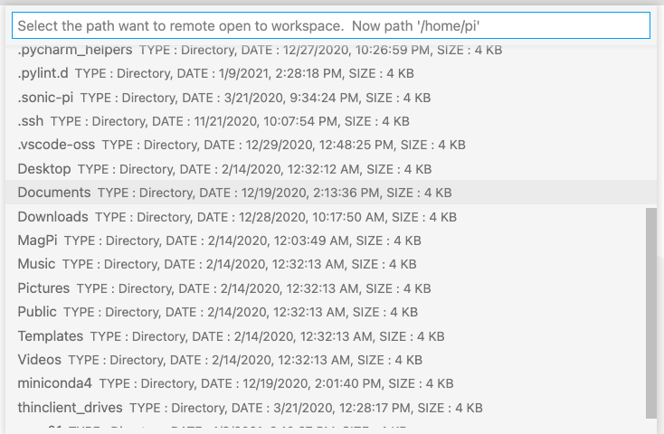
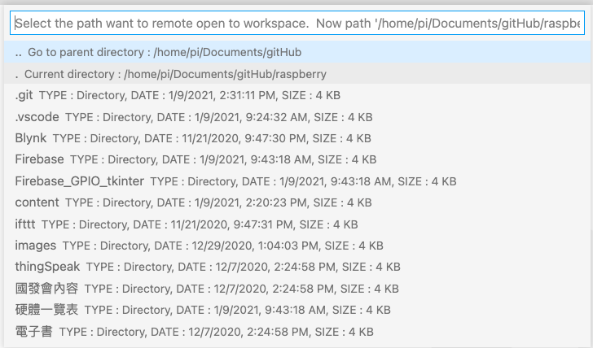

## 遠端連線raspberry

- [從序列埠連線至Raspberry(必需要有TTL線)](https://www.raspberrypi.com.tw/tag/usb-to-ttl/)  
- [查詢Raspberry的 ip Address](#find_ip_address)  
- [使用手機app查詢 Raspberry IP Address](#mobileApp)
- [查詢Raspberry的 IP Address](#find_ip_address) 
- [透過手機 Net Analyzer 查詢Raspberry IP Address](#mobileApp)
- [PC 透過SSH連線至Raspberry](#sshToRaspberryOnPC)  
- [Mac 透過SSH連線至Raspberry](#sshToRaspberryOnMac) 
- [設定raspberry環境](#set_up_raspberry)
- [使用遠端桌面(Microsoft Remote Desktop)](#Microsoft_Remote_Desktop)
- [使用VSCode連線至Raspberry](#vscode)

<a name="find_ip_address"></a>
## 查詢Raspberry的 ip Address
1. 將raspberry連接電源線,螢幕,keyboard,mouse,並開啟手機熱點連線
2. 將raspberry連線至手機熱點


3. 開啟terminal,並查詢ip address

	`$ ifconfig`
	
	
	
<a name="mobileApp"></a>
## 透過手機App Net Analyzer查詢Raspberry IP Address

[iOS](https://apps.apple.com/na/app/network-analyzer/id562315041)

[android](https://play.google.com/store/apps/details?id=net.techet.netanalyzerlite.an&hl=zh_TW&gl=US)

<a name="sshToRaspberryOnPC"></a>
## PC 透過SSH連線到Raspberry
1. 下載並開啟[putty](https://www.chiark.greenend.org.uk/~sgtatham/putty/latest.html)
2. 開啟putty,並用ssh連線到raspberry


<a name="mobileApp"></a>
## 使用手機app查詢 Raspberry IP Address
### Network Analyzer


<a name="sshToRaspberryOnMac"></a>
## Mac 透過SSH連線至Raspberry

```
#開啟terminal
% ssh 帳號@raspberry_ip_address
```


<a name="set_up_raspberry"></a>
## 設定raspberry環境
1. 開啟raspberry環境設定

	$ sudo raspi-config


2.選擇 Interfacing Options
	- VNC關閉，其餘開啟


3.選擇 Localisation Options -> 選擇Change Locale -> 選擇zh-TW.UTF8


4.選擇 Localisation Options -> 選擇Timezone -> 選擇Asia 

 

5.選擇 Localisation Options -> 選擇Change Wi-fi Country -> 選擇TW


6.選擇 Localisation Options -> 選擇Keyboard Layout
	- Model:105-key PC(intl.)
	- Layout:English(UK)
	- Variant:English(UK) 

<a name="Microsoft_Remote_Desktop"></a>
### 使用遠端桌面(Microsoft Remote Desktop)
1. 關閉 vnc Server
2. 透過ssh安裝xrdp

	`sudo apt-get update`
	`sudo apt-get install xrdp -y`

3.使用遠端桌面連線raspberry


<a name="vscode"></a>
### 使用VSCode連線至Raspberry

1. 安裝mac或window版的[vscode](https://code.visualstudio.com)

2. extensions安裝以下套件:

	- [Python(ms-python.python)](https://marketplace.visualstudio.com/items?itemName=ms-python.python)


	- [Jupyter(ms-toolsai.jupyter)](https://marketplace.visualstudio.com/items?itemName=ms-toolsai.jupyter)


	- ftp-simple(humy2833.ftp-simplae)


3. 按下 `F1` 出現命令列，輸入 `ftp-` 選擇 `ftp-simple:Config - FTP connection setting`


4. 修改連線至raspberry的設定


5. 連線raspberry,按下 `F1' 出現命令列，輸入 `ftp-` 選擇 `ftp-simple:Remote directory open to workspace`



6. 選擇裝置名稱


7. 選擇要編輯的raspberry目錄



8. 確認要編輯的目錄(點選 current directory .......)
 
 


