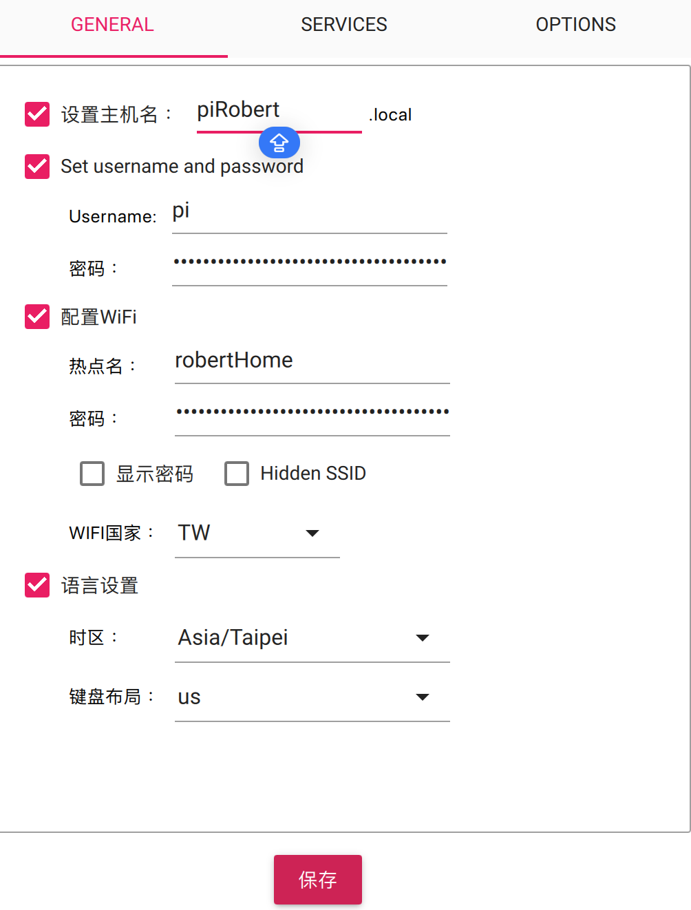
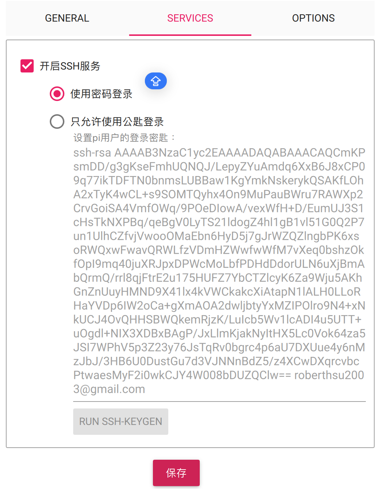
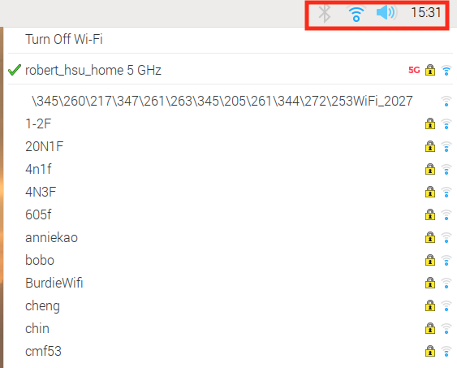
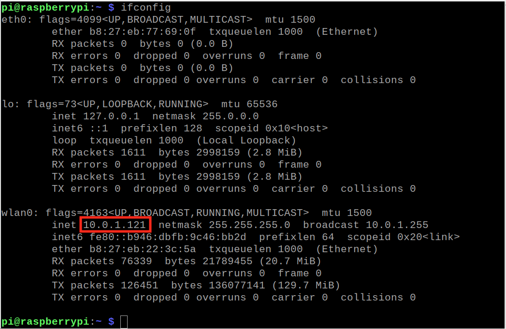
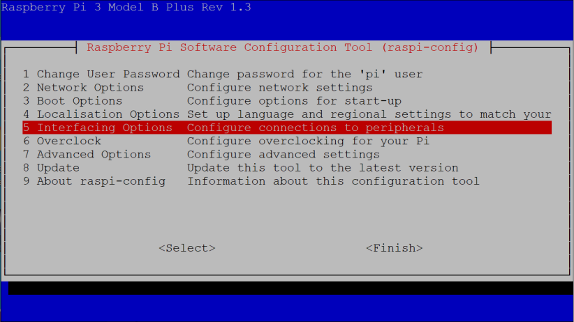
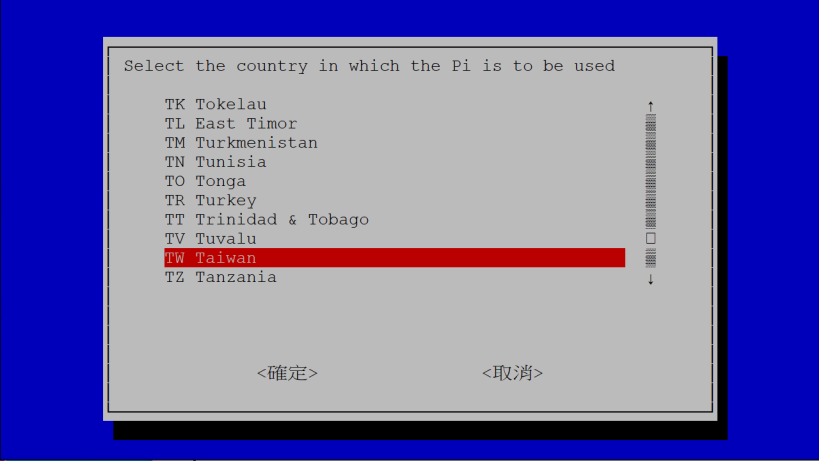
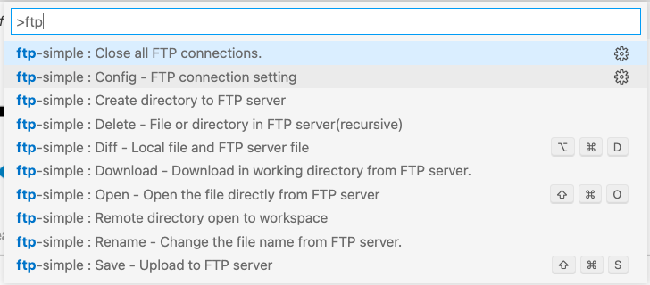

## 遠端連線raspberry

- [從序列埠連線至Raspberry(必需要有TTL線)](https://www.raspberrypi.com.tw/tag/usb-to-ttl/) 
- [建立Raspberry網路上的主機名稱](#host_name)
- [查詢windows的ip address和建立raspberry的固定ip位址](#fixed_ipaddress)
- [查詢Raspberry的 ip Address](#find_ip_address) 
- [透過電腦查詢Raspberry的 ip Address](#pc-ipAddress)
- [透過手機 Net Analyzer 查詢Raspberry IP Address](#mobileApp)
- [PC 透過SSH連線至Raspberry](#sshToRaspberryOnPC)  
- [Mac 透過SSH連線至Raspberry](#sshToRaspberryOnMac) 
- [設定raspberry環境](#set_up_raspberry)
- [使用遠端桌面(VNC viewer)](#VNC_Viewer)
- [使用VSCode連線至Raspberry](#vscode)
- [bash: warning: setlocale: LC_ALL: cannot change locale (en_US.UTF-8)錯誤的解決方法](#en_US.UTF-8)

<a name="host_name"></a>
## 建立Raspberry網路上的名稱,並設定開啟ssh
使用官方燒錄軟體上設定網路名稱,並開啟ssh,如下圖所示:





<a name="fixed_ipaddress"></a>
## 查詢windows的ip address和建立raspberry的固定ip位址
### 1. 查詢windows的ip address 和 DNS
- #### 打開cmd
- #### 執行以下指令
```cmd
ipconfig /all
```

### 2. 建立raspberry的固定ip位址

要為樹莓派的乙太網路（RJ-45）連接設置固定IP地址，可以按照以下步驟進行操作。這涉及編輯網路配置文件以分配靜態IP地址。

### 設置靜態IP地址的步驟

1. **打開樹莓派上的終端機**。
2. **編輯DHCP客戶端配置文件**：
	- 使用文本編輯器如`nano`打開DHCP客戶端配置文件。

    ```other
    sudo nano /etc/dhcpcd.conf
    ```

3. **修改配置文件**：
	- 滾動到文件底部，添加以下幾行。將`eth0`替換為您的網路介面（通常是`eth0`用於乙太網），並設置您所需的靜態IP地址、路由器和域名伺服器（DNS）：

    ```other
    interface eth0
    static ip_address=192.168.1.100/24
    static routers=192.168.1.1
    static domain_name_servers=8.8.8.8 8.8.4.4
    ```


	其中：


		- `192.168.1.100/24` 是您所需的靜態IP地址和子網掩碼。
		- `192.168.1.1` 是您路由器的IP地址。
		- `8.8.8.8` 和 `8.8.4.4` 是Google的公共DNS伺服器。您可以使用您偏好的DNS伺服器。
4. **保存文件並退出**：
	- 按 `Ctrl+X` 退出 `nano`。
	- 按 `Y` 確認更改。
	- 按 `Enter` 保存文件。
5. **重新啟動DHCP客戶端守護進程**：
	- 為了應用更改，使用以下命令重新啟動DHCP客戶端守護進程：

    ```other
    sudo systemctl restart dhcpcd
    ```

6. **確認IP地址**：
	- 檢查IP地址以確保已正確設置：

    ```other
    ip addr show eth0
    ```

	

<a name="find_ip_address"></a>
## 查詢Raspberry的 ip Address
1. 將raspberry連接電源線,螢幕,keyboard,mouse,並開啟手機熱點連線
2. 將raspberry連線至手機熱點



3. 開啟terminal,並查詢ip address

	`$ ifconfig`
	
	
	


<a name="mobileApp"></a>
## 透過電腦查詢Raspberry的 ip Address

```
#mac ping 電腦名稱
$ ping raspberryRobert.local

#window ping 電腦名稱 -4
$ ping raspberryRobert.local -4
```

---

<a name="pc-ipAddress"></a>

## 透過手機App Net Analyzer查詢Raspberry IP Address

[iOS](https://apps.apple.com/na/app/network-analyzer/id562315041)

[android](https://play.google.com/store/apps/details?id=net.techet.netanalyzerlite.an&hl=zh_TW&gl=US)

---

<a name="sshToRaspberryOnPC"></a>
## PC 透過SSH連線到Raspberry
1. 下載並開啟[putty](https://www.chiark.greenend.org.uk/~sgtatham/putty/latest.html)
2. 開啟putty,並用ssh連線到raspberry


---

<a name="mobileApp"></a>

## Mac 透過SSH連線至Raspberry

```
#開啟terminal
ssh 帳號@raspberry_ip_address
ssh 帳號@主機名稱
```

--- 

<a name="set_up_raspberry"></a>
## 設定raspberry環境
1. 開啟raspberry環境設定

	$ sudo raspi-config



2.選擇 Interfacing Options
	- VNC開啟，其餘開啟


3.選擇 Localisation Options -> 選擇Change Locale -> 選擇zh-TW.UTF8


4.選擇 Localisation Options -> 選擇Timezone -> 選擇Asia 

 

5.選擇 Localisation Options -> 選擇Change Wi-fi Country -> 選擇TW



6.選擇 Localisation Options -> 選擇Keyboard Layout
	- Model:105-key PC(intl.)
	- Layout:English(UK)
	- Variant:English(UK) 


### 建立新的使用者帳號

```
sudo adduser pi1
sudo adduser pi1 sudo
```

<a name="VNC_Viewer"></a>
### 使用遠端桌面(VNC Viewer)
1. 開啟 raspberry pi 內建的vnc server
2. 下載 vnc viewer
3. 使用vnc viewer連線raspberry


---

<a name="vscode"></a>

### 使用VSCode extention ftp-simple 連線至Raspberry

1. 安裝mac或window版的[vscode](https://code.visualstudio.com)

2. extensions安裝以下套件:

	- [Python(ms-python.python)](https://marketplace.visualstudio.com/items?itemName=ms-python.python)


	- [Jupyter(ms-toolsai.jupyter)](https://marketplace.visualstudio.com/items?itemName=ms-toolsai.jupyter)


	- ftp-simple(humy2833.ftp-simplae)


3. 按下 `F1` 出現命令列，輸入 `ftp-` 選擇 `ftp-simple:Config - FTP connection setting`



4. 修改連線至raspberry的設定


5. 連線raspberry,按下 `F1' 出現命令列，輸入 `ftp-` 選擇 `ftp-simple:Remote directory open to workspace`


6. 選擇裝置名稱


7. 選擇要編輯的raspberry目錄


8. 確認要編輯的目錄(點選 current directory .......)
 
 
 
 ## 使用VSCode extention remote-ssh 連線至Raspberry(建議使用)
 
 ---
 
 <a name="en_US.UTF-8"></a>
 ## bash: warning: setlocale: LC_ALL: cannot change locale (en_US.UTF-8)錯誤的解決方法
 
 ```bash
 sudo vim /etc/locale.gen
 
 將#en_US.UTF-8改為en_US.UTF-8(沒有#)
 
 sudo locale-gen
 ```


